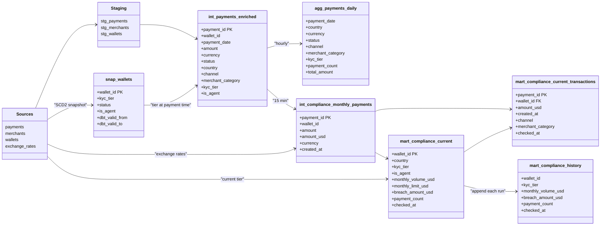
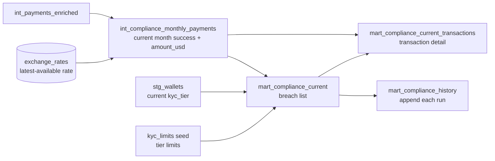

# Wave mobile money - analytics engineering design

## Overview

This document describes the data architecture for two use cases built on three source tables (payments, merchants, wallets):

1. **KPI dashboards** - hourly-refreshed aggregated metrics with current and historical values (required)
2. **Compliance checks** - 15-minute KYC limit monitoring with a running historical log (optional scope - delivered)

---

## Project structure

```
wave_mobile_money/
├── dbt_project.yml               project config, directory-level defaults, vars
├── packages.yml                  dbt_utils dependency
├── DESIGN.md
├── snapshots/
│   └── snap_wallets.sql          SCD2 wallet history (kyc_tier, status, is_agent)
├── seeds/
│   └── kyc_limits.csv            tier → monthly USD limit mapping
├── macros/
│   └── incremental_lookback.sql  reusable updated_at watermark filter
├── models/
│   ├── staging/
│   │   ├── _sources.yml          source definitions (payments, merchants, wallets, exchange_rates)
│   │   ├── _staging.yml          staging model docs and tests
│   │   ├── stg_payments.sql      incremental merge on payment_id
│   │   ├── stg_merchants.sql     view
│   │   └── stg_wallets.sql       view
│   ├── intermediate/
│   │   ├── _intermediate.yml
│   │   ├── int_payments_enriched.sql              incremental merge, enriched with merchant + wallet SCD2
│   │   └── int_compliance_monthly_payments.sql    table, current-month success payments with amount_usd
│   └── marts/
│       ├── kpi/
│       │   ├── _kpi.yml
│       │   └── agg_payments_daily.sql  incremental delete+insert, pre-aggregated KPI table
│       └── compliance/
│           ├── _compliance.yml
│           ├── mart_compliance_current.sql              table, full replace every 15 min
│           ├── mart_compliance_current_transactions.sql table, full replace every 15 min
│           └── mart_compliance_history.sql              incremental append
```

---

## Source tables

| Table | Scale | Key properties |
|---|---|---|
| `payments` | Billions of rows | `status` overwritten in place on reversal; `updated_at` is the change signal |
| `merchants` | Thousands of rows | Stable reference; category/status may change infrequently |
| `wallets` | Millions of rows | `kyc_tier` overwritten in place on upgrade; tiers only increase (0 → 1 → 2) |
| `exchange_rates` | One row per currency per day | USD conversion rates; used only by compliance models for KYC-limit evaluation |

Payments, merchants, and wallets refresh every 15 minutes. Exchange rates are assumed to refresh daily.

---

## Key design challenges

### Reversals in payments

When a payment is reversed, the source row is updated in place:

```
status:     success → reversed
updated_at: <original> → <reversal timestamp>
created_at: unchanged
```

This means:
- `created_at` is immutable and represents the original transaction date
- `updated_at` is the only signal that a record has changed
- Any incremental load must watermark on `updated_at`, not `created_at`
- A reversal today must re-aggregate the original `created_at` date in pre-aggregated tables

### KYC tier mutability

`kyc_tier` in wallets is overwritten in place, as is `status` (active/inactive/blocked). `snap_wallets` (SCD2, timestamp strategy on `updated_at`) captures changes to all wallet fields over time. `int_payments_enriched` joins `snap_wallets` on wallet_id and a date range to resolve the tier valid at the time of each payment, enabling accurate historical KPI breakdowns by tier. Compliance models join `stg_wallets` separately for current-tier checks, which is correct since compliance targets only the current month.

### Scale asymmetry

Billion-row fact tables require incremental loading. Reference tables (merchants, wallets) are small enough to join on every run.

### Cadence divergence

Sources refresh every 15 minutes. Compliance requires 15-minute freshness. KPI dashboards require only hourly freshness. Upstream models run at 15-minute cadence; the KPI aggregation mart runs hourly via a separate orchestrator job.

---

## Architecture

Classes show key fields only; full column lists and tests live in the schema YAMLs.



---

## Use case 1: KPI dashboards

### Requirements

- Hourly refresh
- Current and historical values
- Breakdown by: country, status, channel, merchant category, KYC tier
- Metrics: total payments, gross volume (non-failed), net volume (success only)
- Performance valued highly

### Design

The critical performance decision is pre-aggregation. Querying billions of raw payments at dashboard load time is not viable. Instead, `agg_payments_daily` pre-computes daily aggregates and serves as the dashboard's sole data source.

When a payment is reversed, `stg_payments` picks up the change via the `updated_at` watermark and merges the updated row. `agg_payments_daily` then uses a `delete+insert` strategy keyed on `payment_date` - it deletes all rows for any affected date and re-aggregates from scratch, ensuring reversals are reflected on the original payment date rather than the reversal date.

**Dashboard query pattern**

The BI layer derives all three KPI metrics from a single table:

```sql
select
    payment_date,
    country,
    sum(payment_count)                                              as total_payments,
    sum(case when status != 'failed' then total_amount end)        as gross_volume,
    sum(case when status = 'success' then total_amount end)        as net_volume
from agg_payments_daily
where payment_date between :start_date and :end_date
group by 1, 2
```

`total_amount` is in local currency. Cross-country volume comparisons require currency conversion at the BI layer.

### Snapshot: `snap_wallets`

SCD2 snapshot of the wallets table. See [Supporting artefacts](#supporting-artefacts) for full detail. The Use Case 1 dependency is the join in `int_payments_enriched` that resolves `kyc_tier` and `is_agent` at payment creation time:

```sql
left join snap_wallets w
    on p.wallet_id = w.wallet_id
    and p.created_at >= w.dbt_valid_from
    and (p.created_at < w.dbt_valid_to or w.dbt_valid_to is null)
```

### Model: `stg_payments`

```
materialized: incremental
strategy:     merge
unique_key:   payment_id
cluster_by:   [updated_at]
cadence:      15 min
```

Watermarks on `updated_at` via the `incremental_lookback` macro (default 3-hour lookback). Clustering on `updated_at` allows Snowflake micro-partition pruning to make each incremental scan fast even at billion-row scale.

### Model: `int_payments_enriched`

```
materialized: incremental
strategy:     merge
unique_key:   payment_id
cluster_by:   [updated_at, payment_date]
cadence:      15 min
```

Joins the incremental payment slice against:
- `stg_merchants` (thousands - broadcast join) for `merchant_category`
- `snap_wallets` (SCD2) for `kyc_tier` and `is_agent` valid at `created_at`; both fields reflect what the wallet held at the time of the payment, not the current state

The wallet join resolves the tier held at time of transaction:

```sql
left join snap_wallets w
    on p.wallet_id = w.wallet_id
    and p.created_at >= w.dbt_valid_from
    and (p.created_at < w.dbt_valid_to or w.dbt_valid_to is null)
```

This ensures historical KPI breakdowns by KYC tier are accurate - a wallet that upgraded from tier 0 to tier 1 in February correctly shows tier 0 for all January transactions.

### Model: `agg_payments_daily`

```
materialized: incremental
strategy:     delete+insert
unique_key:   payment_date  (delete key, not the grain)
cluster_by:   [payment_date]
cadence:      60 min
```

Grain: `(payment_date, country, currency, status, channel, merchant_category, kyc_tier)`.

The `unique_key = 'payment_date'` is the delete target, not the true grain. On each run:
1. Find distinct `payment_date` values where any payment has `updated_at >= max(last_loaded_at) - lookback`
2. Delete all existing rows for those dates from the target
3. Re-aggregate all payments for those dates and insert

---

## Use case 2: Compliance checks (optional scope - delivered)

### Requirements

- Check every 15 minutes
- List breaching wallets for the current calendar month with transaction details
- Historical record of all checks

### Design



**KYC tier and monthly limits**

| Tier | Monthly limit |
|---|---|
| 0 | USD 100 |
| 1 | USD 1,000 |
| 2 | USD 10,000 |

The current `kyc_tier` from `stg_wallets` determines the compliance limit. Since tiers only increase, the current tier is always the highest limit the wallet has ever held - the most favourable interpretation. `snap_wallets` is used separately by `int_payments_enriched` for historical KPI tier accuracy; compliance models do not need it because they target only the current month.

**Materialization: why `table` instead of incremental**

`int_compliance_monthly_payments`, `mart_compliance_current`, and `mart_compliance_current_transactions` are all materialised as `table` - a full drop-and-recreate on every 15-minute run. Incremental was deliberately avoided because the breach list must always reflect the exact current state: a wallet that falls below its limit (e.g. due to a reversal) must disappear from `mart_compliance_current` on the next run. An incremental model would require explicit deletes to achieve this; a full replace handles it automatically with no extra logic. The dataset is small enough (one month of success payments, breaching wallets only) that a full replace every 15 minutes is cheap.

**What counts toward the monthly volume**

Only `status = 'success'` transactions. Reversed transactions are excluded because a reversal unwinds the original transaction. Failed transactions are excluded because they never processed. This is the most intuitive interpretation of "amount transacted".

**Currency conversion**

KYC limits are denominated in USD. Payments are in local currency. A latest-available-rate fallback is used:

```sql
er.rate_date = (
    select max(rate_date)
    from exchange_rates
    where currency = p.currency
    and rate_date <= p.created_at::date
)
```

A `not_null` test on `amount_usd` in `mart_compliance_current_transactions` fails loudly if any currency has no rate loaded, rather than silently under-counting.

### Model: `int_compliance_monthly_payments`

```
materialized: table
cadence:      15 min
```

Single source of truth for both compliance mart models. Filters `int_payments_enriched` to current-month `status = 'success'` payments and joins `exchange_rates` once (latest-available-rate fallback) to produce `amount_usd`. Eliminates the duplicated exchange rate join that would otherwise appear in both downstream models.

### Model: `mart_compliance_current`

```
materialized: table
cadence:      15 min
```

Fully replaced on every run. Aggregates `int_compliance_monthly_payments` by wallet, joins `stg_wallets` for current `kyc_tier` and `kyc_limits` for the monthly USD limit, and returns one row per wallet exceeding its limit.

### Model: `mart_compliance_current_transactions`

```
materialized: table
cadence:      15 min
```

One row per payment for every breaching wallet. Filters `int_compliance_monthly_payments` by the wallet IDs in `mart_compliance_current`. No exchange rate join needed - `amount_usd` is already present from the intermediate model.

Note: `kyc_tier` on transaction rows reflects the tier at payment time (resolved via `snap_wallets` in `int_payments_enriched`). The wallet-level `kyc_tier` on `mart_compliance_current` reflects the current tier used for limit evaluation. These can differ for wallets that upgraded mid-month; this is intentional and correct.

### Model: `mart_compliance_history`

```
materialized: incremental
strategy:     append (no unique_key)
cluster_by:   [checked_at]
cadence:      15 min
```

Selects all rows from `mart_compliance_current` on every run. Each run appends a new snapshot of the breaching wallet list with its `checked_at` timestamp. Grows monotonically - never updated or deleted. Clustered on `checked_at` for efficient time-range queries.

**Month rollover**: on the first run of each new calendar month, `mart_compliance_current` resets to an empty set (no payments yet this month, so no breaches). The last append of the prior month remains as the final state of that month in history.

**Mid-month reversal**: if a reversal reduces a wallet's monthly volume below its limit, the wallet exits the breach list on the next run and does not appear in subsequent history appends. The history table records this as the wallet simply not appearing after a certain `checked_at`.

---

## Supporting artefacts

### Macro: `incremental_lookback`

Generates the `WHERE updated_at >= max(updated_at) - N hours` filter used identically in `stg_payments` and `int_payments_enriched`. Centralises the lookback logic so changes to the window only require updating the `incremental_lookback_hours` var in `dbt_project.yml`.

```sql

  
  where {{ timestamp_col }} >= (
      select dateadd(hour, -{{ var('incremental_lookback_hours', 3) }}, max({{ timestamp_col }}))
      from {{ this }}
  )
  

```

### Seed: `kyc_limits`

Maps `kyc_tier` (0/1/2) to `monthly_limit_usd` (100/1,000/10,000). Stored as a seed rather than hardcoded in SQL so limits can be updated without a model change - especially relevant if regulatory bodies revise thresholds.

### Snapshot: `snap_wallets`

SCD2 on the wallets source table. Timestamp strategy on `updated_at`. Runs daily - wallet tier changes are infrequent relative to payment cadence. Enables `int_payments_enriched` to resolve `kyc_tier` and `is_agent` at the time of each payment for accurate historical KPI breakdowns.

### Packages: `dbt_utils`

Used for `expression_is_true` tests that enforce business rules not expressible with built-in tests (e.g. `amount >= 0`, `payment_count > 0`, `breach_amount_usd > 0`, `monthly_volume_usd > 0`).

---

## Testing strategy

Tests are defined in schema YAML files (`_staging.yml`, `_intermediate.yml`, `_kpi.yml`, `_compliance.yml`) at every layer.

**Structural tests** - data integrity

| Test | Applied to |
|---|---|
| `unique + not_null` | All primary keys: `payment_id`, `merchant_id`, `wallet_id` |
| `not_null` | All required fields: amounts, timestamps, status, country |
| `relationships` | `stg_payments.wallet_id` → `stg_wallets`, `stg_payments.merchant_id` → `stg_merchants`, `mart_compliance_current_transactions.wallet_id` → `mart_compliance_current` |

**Domain tests** - enumerated values

| Test | Fields |
|---|---|
| `accepted_values` | `status` (success/failed/reversed), `channel` (ussd/app/agent), `kyc_tier` (0/1/2), `merchant category` (supermarket/ecommerce/taxi/utility/other), wallet `status` (active/inactive/blocked) |

**Business rule tests** - logical constraints via `dbt_utils.expression_is_true`

| Rule | Model |
|---|---|
| `amount >= 0` | `stg_payments` |
| `payment_count > 0` | `agg_payments_daily` |
| `monthly_volume_usd > 0` | `mart_compliance_current` (breach condition `> monthly_limit_usd` is enforced by the model's WHERE clause) |
| `breach_amount_usd > 0` | `mart_compliance_current`, `mart_compliance_history` |
| `amount_usd IS NOT NULL` | `mart_compliance_current_transactions` - fails loudly if a currency has no exchange rate, preventing silent breach under-counts |

---

## Documentation

Every model and column has a description in its schema YAML file, enabling `dbt docs generate` to produce a fully browsable data catalogue. Column descriptions include:
- grain and materialization strategy
- business meaning of status values and enumerations
- known limitations (e.g. bootstrap limitation on `snap_wallets`, tier-source asymmetry between compliance aggregates and transaction detail)
- derivation formulas (e.g. `breach_amount_usd = monthly_volume_usd - monthly_limit_usd`)

---

## Orchestration

Three jobs cover all cadences:

| Command | Models / artefacts | Schedule |
|---|---|---|
| `dbt snapshot` | `snap_wallets` | Daily, before the first 15-min job of the day |
| `dbt build --select tag:every_15m` | staging, intermediate, compliance marts | Every 15 min |
| `dbt build --select tag:hourly` | `agg_payments_daily` | Every 60 min |

Snapshots run via `dbt snapshot`, not `dbt build`, so they must be scheduled as a separate orchestrator step. The snapshot job must complete before the 15-min jobs start so that `int_payments_enriched` always has an up-to-date `snap_wallets` to join against.

Compatible with dbt Cloud, Airflow, and Dagster.

---

## Assumptions

| # | Assumption | Justification |
|---|---|---|
| 1 | Snowflake is the data warehouse | DDL syntax: `timestamp_ntz`, `number(12,2)`, `varchar` |
| 2 | Only `status = 'success'` counts toward monthly KYC volume | Reversed = unwound; failed = never processed. Most intuitive interpretation of "amount transacted" |
| 3 | `exchange_rates` table exists with daily granularity per currency | KYC limits are USD-denominated; payments are in local currency |
| 4 | Exchange rate fallback: latest available rate on or before payment date | Handles days where today's rate is not yet loaded |
| 5 | Monthly KYC limit is based on current `kyc_tier` | Tiers only increase so current tier is always the highest-ever limit - most favourable interpretation |
| 6 | Historical KYC tier in `agg_payments_daily` reflects tier at time of transaction | Resolved via `snap_wallets` SCD2 join in `int_payments_enriched` |
| 7 | Agents (`is_agent = true`) are subject to the same KYC limits | No exemption stated in the brief; `is_agent` is exposed on mart models for filtering |
| 8 | `merchant_id IS NULL` means P2P transfer | merchant_id is nullable in the source DDL |
| 9 | Lookback window of 3 hours for incremental filters | Protects against late-arriving ingestion; configurable via `incremental_lookback_hours` var |
| 10 | Upstream staging and intermediate models run every 15 min; KPI mart runs hourly | Source refresh is 15 min; compliance SLA is 15 min; KPI SLA is 1 hour |

---

## Alternatives considered

### dbt snapshot on payments

Would create SCD2 history of status changes. Rejected because dbt snapshots perform a full-table comparison JOIN on every run - prohibitive at billion-row scale. The `merge + updated_at` watermark approach achieves the same current-state correctness without the per-run cost.

### Microbatch incremental strategy

`incremental_strategy='microbatch'` partitions by `event_time` (typically `created_at`). Reversals change the `updated_at` of records whose `created_at` may be months in the past. Any microbatch lookback window would miss these historical reversals. Rejected in favour of merge on `payment_id` with `updated_at` watermark.

### Snowflake streams / CDC

Native CDC is the most efficient mechanism for mutable source tables and the preferred long-term architecture. Each 15-min run would process only the rows that actually changed, with no watermark scanning at all. Deferred because it requires infrastructure setup outside dbt. The merge + watermark approach is portable across warehouse adapters and meets current SLAs.

### Hourly aggregation instead of daily

`agg_payments_hourly` would enable sub-daily dashboard drill-down. Rejected because reversals create a fan-out problem: a single reversal could require re-aggregating up to hundreds of historical hourly buckets. Daily grain confines re-aggregation to one affected calendar date per reversal.

### Store all wallets in compliance history

Writing every wallet's monthly volume on each 15-minute run would produce millions of rows per run: 4 runs/hour × 24 hours × millions of wallets ≈ billions of rows per month. Storing only breaching wallets keeps the history table proportional to actual compliance events and is sufficient to measure compliance over time.

---

## Known challenges and mitigations

| Challenge | Mitigation |
|---|---|
| Reversal fan-out in `agg_payments_daily` - affected dates scatter across history | Dual clustering on `int_payments_enriched (updated_at, payment_date)` makes both the affected-date scan and the re-aggregation scan efficient |
| Exchange rate coverage gaps | Latest-available-rate fallback in compliance models; `not_null` test on `amount_usd` fails loudly on any uncovered currency |
| Month rollover resets `mart_compliance_current` | Final state of each month preserved as the last append in `mart_compliance_history` before midnight on the last day |
| Wallet briefly exits and re-enters breach list after a reversal | History table records the oscillation via `checked_at`; analysts can observe the full trajectory |
| snap_wallets bootstrap limitation: tiers before first snapshot run are unrecoverable | One-time limitation; affects only wallets that changed tier before pipeline start. Diminishes as snapshot accumulates history. Documented as assumption. |
| Orchestrator must preserve model run order within a job | dbt resolves DAG dependencies automatically; cross-job ordering (e.g., staging before compliance marts) requires orchestrator-level dependency configuration |
