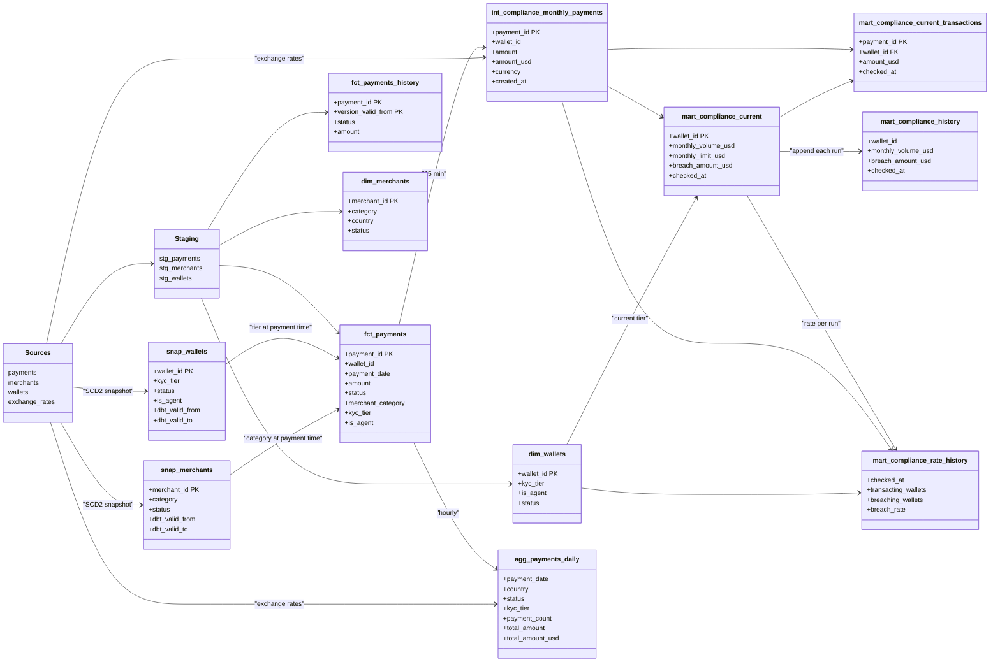
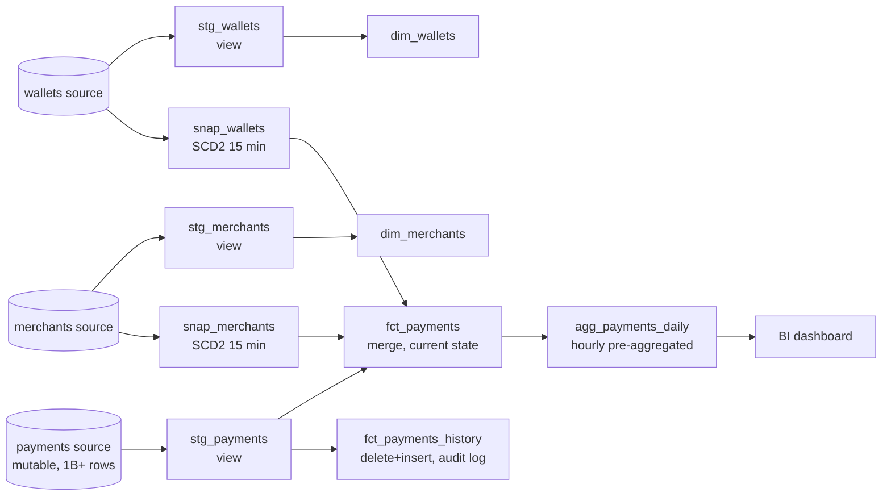
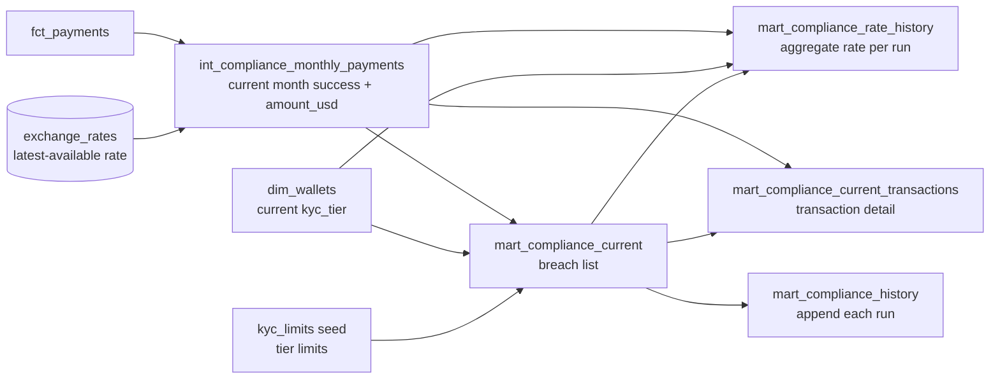

# Wave mobile money - analytics engineering design

## Overview

This document describes the data architecture for two use cases built on three source tables (payments, merchants, wallets):

1. **KPI dashboards** - hourly-refreshed aggregated metrics with current and historical values (required)
2. **Compliance checks** - 15-minute KYC limit monitoring with a running historical log (optional scope - delivered)

---

## Project structure

```
wave_mobile_money/
├── dbt_project.yml               project config, directory-level defaults, vars
├── packages.yml                  dbt_utils dependency
├── DESIGN.md
├── snapshots/
│   ├── snap_wallets.yml          SCD2 wallet history (kyc_tier, status, is_agent)
│   └── snap_merchants.yml        SCD2 merchant history (category, status)
├── seeds/
│   └── kyc_limits.csv            tier → monthly USD limit mapping
├── macros/
│   └── incremental_lookback.sql  reusable updated_at watermark filter
├── models/
│   ├── staging/                  all views
│   │   ├── _sources.yml          source definitions (payments, merchants, wallets, exchange_rates)
│   │   ├── _staging.yml          staging model docs and tests
│   │   ├── stg_payments.sql
│   │   ├── stg_merchants.sql
│   │   └── stg_wallets.sql
│   ├── intermediate/
│   │   ├── _intermediate.yml
│   │   └── int_compliance_monthly_payments.sql    table, current-month success payments with amount_usd
│   └── marts/
│       ├── core/
│       │   ├── _core.yml
│       │   ├── fct_payments.sql         incremental merge, enriched fact table (current state)
│       │   ├── fct_payments_history.sql incremental delete+insert, audit log of payment state changes
│       │   ├── dim_merchants.sql        view
│       │   └── dim_wallets.sql          view
│       ├── kpi/
│       │   ├── _kpi.yml
│       │   └── agg_payments_daily.sql  incremental delete+insert, pre-aggregated KPI table
│       └── compliance/
│           ├── _compliance.yml
│           ├── mart_compliance_current.sql              table, full replace every 15 min
│           ├── mart_compliance_current_transactions.sql table, full replace every 15 min
│           ├── mart_compliance_history.sql              incremental append, breach rows per run
│           └── mart_compliance_rate_history.sql         incremental append, aggregate rate per run
```

---

## Source tables

| Table | Scale | Key properties |
|---|---|---|
| `payments` | Billions of rows | `status` overwritten in place on reversal; `updated_at` is the change signal |
| `merchants` | Thousands of rows | Stable reference; category/status may change infrequently |
| `wallets` | Millions of rows | `kyc_tier` overwritten in place on upgrade; tiers only increase (0 → 1 → 2) |
| `exchange_rates` | One row per currency per day | USD conversion rates; used by compliance and KPI models |

Payments, merchants, and wallets refresh every 15 minutes. Exchange rates refresh daily.

---

## Key design challenges

When a payment is reversed, the source row is updated in place:

```
status:     success → reversed
updated_at: <original> → <reversal timestamp>
created_at: unchanged
```

`created_at` is immutable; `updated_at` is the only change signal. All incremental loads watermark on `updated_at`, and a reversal must re-aggregate the original `created_at` date in pre-aggregated tables.

`kyc_tier` (wallets) and `category` (merchants) are also overwritten in place. `snap_wallets` and `snap_merchants` (SCD2, timestamp strategy on `updated_at`) capture history so `fct_payments` can resolve both values at payment time via a date-range join, keeping historical KPI breakdowns accurate. Compliance models use `dim_wallets` directly since they target only the current month.

Payments are at billion-row scale and require incremental loading; merchants and wallets are small enough to join on every run. Sources refresh every 15 minutes - snapshots, staging, intermediate, and compliance models share that cadence; the KPI aggregation mart runs hourly.

---

## Architecture

Classes show key fields only; full column lists and tests live in the schema YAMLs.



---

## Use case 1: KPI dashboards

### Requirements

- Hourly refresh
- Current and historical values
- Breakdown by: country, status, channel, merchant category, KYC tier
- Metrics: total payments, gross volume (non-failed), net volume (success only)
- Performance valued highly

### Design



Pre-aggregation is the key performance decision. Querying billions of raw payments at dashboard load is not viable. `agg_payments_daily` pre-computes daily aggregates and is the dashboard's sole data source.

When a payment is reversed, `stg_payments` picks up the change via the `updated_at` watermark and merges the updated row. `agg_payments_daily` then uses a `delete+insert` strategy keyed on `payment_date` - it deletes all rows for any affected date and re-aggregates from scratch, so reversals appear on the original payment date, not the reversal date.

**Dashboard query pattern**

```sql
select
    payment_date,
    country,
    sum(payment_count)                                              as total_payments,
    sum(case when status != 'failed' then total_amount end)        as gross_volume,
    sum(case when status = 'success' then total_amount end)        as net_volume
from agg_payments_daily
where payment_date between :start_date and :end_date
group by 1, 2
```

`total_amount` is in local currency and is the authoritative amount. `total_amount_usd` is pre-computed for cross-currency rollups and is null when no exchange rate covers the currency.

### Model: `stg_payments`

```
materialized: view
cadence:      15 min (always current - view over source)
```

Pure view over the source payments table. Inherits `+materialized: view` from `dbt_project.yml`. Tests are `WHERE`-scoped to the last 24 hours to avoid full billion-row source scans.

### Model: `fct_payments`

```
materialized: incremental
strategy:     merge
unique_key:   payment_id
cluster_by:   [updated_at::date, payment_date]
cadence:      15 min
```

Core fact table. Joins the incremental payment slice against `snap_merchants` and `snap_wallets` (both SCD2) using a date-range predicate so that `merchant_category` and `kyc_tier` reflect the values in effect at payment time, not today's values:

```sql
left join snap_merchants m
    on p.merchant_id = m.merchant_id
    and p.created_at >= m.dbt_valid_from
    and (p.created_at < m.dbt_valid_to or m.dbt_valid_to is null)
left join snap_wallets w
    on p.wallet_id = w.wallet_id
    and p.created_at >= w.dbt_valid_from
    and (p.created_at < w.dbt_valid_to or w.dbt_valid_to is null)
```

Clustering on `updated_at::date` and `payment_date` gives Snowflake useful micro-partition boundaries for both the incremental filter scan and the reversal re-aggregation scan.

### Model: `fct_payments_history`

```
materialized: incremental
strategy:     delete+insert
unique_key:   [payment_id, version_valid_from]
cadence:      15 min
```

One row per payment state change, keyed on `(payment_id, version_valid_from)`. Captures reversal events so reversal rates and point-in-time status can be derived. `delete+insert` on the composite key keeps reruns idempotent despite the 3-hour lookback window.

### Model: `agg_payments_daily`

```
materialized: incremental
strategy:     delete+insert
unique_key:   payment_date  (delete key, not the true grain)
cluster_by:   [payment_date]
cadence:      60 min
```

Grain: `(payment_date, country, currency, status, channel, merchant_category, kyc_tier)`.

On each run: find distinct `payment_date` values where any payment has `updated_at >= watermark - lookback`, delete all rows for those dates, re-aggregate all payments for those dates and insert. The watermark is `max_source_updated_at` (highest source `updated_at` seen in the last run), stored as a column in the table and used by the `incremental_lookback` macro.

---

## Use case 2: Compliance checks (optional scope - delivered)

### Requirements

- Check every 15 minutes
- List breaching wallets for the current calendar month with transaction details
- Historical record of all checks

### Design



**KYC tiers and monthly limits**

| Tier | Monthly limit |
|---|---|
| 0 | USD 100 |
| 1 | USD 1,000 |
| 2 | USD 10,000 |

The current `kyc_tier` from `dim_wallets` determines the compliance limit. Since tiers only increase, the current tier is also the highest limit the wallet has ever held, which is the correct interpretation for enforcement purposes.

**Why `table` instead of incremental for compliance models**

`int_compliance_monthly_payments`, `mart_compliance_current`, and `mart_compliance_current_transactions` are materialised as `table` - a full replace on every 15-minute run. A wallet that falls below its limit (e.g. after a reversal) must exit the breach list immediately on the next run; a full replace handles this with no extra logic. The dataset (one month of success payments, breaching wallets only) is small enough that a full replace every 15 minutes is cheap.

**What counts toward monthly volume**

Only `status = 'success'` transactions. Reversed transactions are excluded because a reversal unwinds the original payment. Failed transactions never processed.

**Currency conversion**

KYC limits are in USD. A latest-available-rate fallback is used:

```sql
er.rate_date = (
    select max(rate_date)
    from exchange_rates
    where currency = p.currency
    and rate_date <= p.created_at::date
)
```

A `not_null` test on `amount_usd` in `mart_compliance_current_transactions` surfaces any uncovered currency rather than silently under-counting.

### Model: `int_compliance_monthly_payments`

```
materialized: table
cadence:      15 min
```

Single source of truth for both compliance mart models. Filters `fct_payments` to current-month `status = 'success'` payments and joins `exchange_rates` once to produce `amount_usd`, eliminating a duplicated join across downstream models.

### Model: `mart_compliance_current`

```
materialized: table
cadence:      15 min
```

Fully replaced on every run. Aggregates `int_compliance_monthly_payments` by wallet, joins `dim_wallets` for current `kyc_tier` and `kyc_limits` for the monthly limit, and returns one row per wallet exceeding its limit.

### Model: `mart_compliance_current_transactions`

```
materialized: table
cadence:      15 min
```

One row per payment for every breaching wallet. `kyc_tier` on transaction rows reflects the tier at payment time (from `snap_wallets` via `fct_payments`); the wallet-level `kyc_tier` on `mart_compliance_current` reflects the current tier used for limit evaluation. These can differ for wallets that upgraded mid-month; this is intentional.

### Model: `mart_compliance_history`

```
materialized: incremental
strategy:     append (no unique_key)
cadence:      15 min
```

Appends the full contents of `mart_compliance_current` on every run. Grows monotonically. Records the trajectory of breaching wallets over time, including wallets that exit and re-enter the breach list after a reversal.

### Model: `mart_compliance_rate_history`

```
materialized: incremental
strategy:     append (no unique_key)
cadence:      15 min
```

One row per 15-minute run with `total_active_wallets`, `transacting_wallets`, `breaching_wallets`, and `breach_rate`. Complements `mart_compliance_history` (which gives the individual breach rows) by providing the denominator needed to compute breach rate over time. `checked_at` is sourced from `mart_compliance_current` so both history tables share the same run timestamp.

---

## Supporting artefacts

### Macro: `incremental_lookback`

Generates the `WHERE timestamp_col >= max(watermark_col) - N hours` filter used by all incremental models. An optional `watermark_col` argument allows the filter column and watermark column to differ - used by `agg_payments_daily` where the filter is on `fct_payments.updated_at` but the stored watermark is `this.max_source_updated_at`. Centralises the lookback logic so changes to the window only require updating `incremental_lookback_hours` in `dbt_project.yml`.

```sql

    
    where {{ timestamp_col }} >= (
        select dateadd(
            hour,
            -{{ var('incremental_lookback_hours', 3) }},
            max({{ watermark_col if watermark_col else timestamp_col }})
        )
        from {{ this }}
    )
    

```

### Seed: `kyc_limits`

Maps `kyc_tier` (0/1/2) to `monthly_limit_usd` (100/1,000/10,000). Stored as a seed so limits can be updated without a model change - relevant if regulatory bodies revise thresholds.

### Snapshots: `snap_wallets`, `snap_merchants`

SCD2 on wallets and merchants respectively. Timestamp strategy on `updated_at`. Runs every 15 minutes alongside the fact table so `fct_payments` always resolves dimension values against current SCD2 history. `snap_wallets` covers `kyc_tier`, `status`, and `is_agent`; `snap_merchants` covers `category` and `status`.

### Packages: `dbt_utils`

Used for `expression_is_true` tests that enforce business rules not expressible with built-in tests (e.g. `amount >= 0`, `payment_count > 0`, `breach_amount_usd > 0`).

---

## Testing strategy

Tests are defined in schema YAML files at every layer.

**Structural tests**

| Test | Applied to |
|---|---|
| `unique + not_null` | All primary keys: `payment_id`, `merchant_id`, `wallet_id` |
| `not_null` | All required fields: amounts, timestamps, status, country |
| `relationships` | `stg_payments.merchant_id` → `stg_merchants`; `mart_compliance_current_transactions.wallet_id` → `mart_compliance_current` |

**Domain tests**

| Test | Fields |
|---|---|
| `accepted_values` | `status` (success/failed/reversed), `channel` (ussd/app/agent), `kyc_tier` (0/1/2), `merchant category` (supermarket/ecommerce/taxi/utility/other), wallet `status` (active/inactive/blocked) |

**Business rule tests** (via `dbt_utils.expression_is_true`)

| Rule | Model |
|---|---|
| `amount >= 0` | `stg_payments` |
| `payment_count > 0` | `agg_payments_daily` |
| `monthly_volume_usd > 0` | `mart_compliance_current` |
| `breach_amount_usd > 0` | `mart_compliance_current`, `mart_compliance_history` |
| `amount_usd IS NOT NULL` | `mart_compliance_current_transactions` - surfaces missing exchange rates rather than silently under-counting |

Heavy uniqueness tests on `stg_payments` and `fct_payments` are `WHERE`-scoped to the last 24 hours to avoid full billion-row source scans.

---

## Documentation

Every model and column has a description in its schema YAML, enabling `dbt docs generate` to produce a browsable data catalogue. Descriptions include grain, materialization strategy, business meaning, and known limitations.

---

## Orchestration

| Command | Models / artefacts | Schedule |
|---|---|---|
| `dbt snapshot && dbt build --select tag:every_15m` | snapshots, staging, intermediate, compliance marts, `fct_payments`, `fct_payments_history` | Every 15 min |
| `dbt build --select tag:hourly` | `agg_payments_daily` | Every 60 min |

Snapshots run first within the 15-minute job so `fct_payments` always joins against up-to-date SCD2 history. Compatible with dbt Cloud, Airflow, and Dagster.

---

## Assumptions

| # | Assumption | Justification |
|---|---|---|
| 1 | Snowflake is the data warehouse | DDL syntax: `timestamp_ntz`, `number(12,2)`, `varchar` |
| 2 | Only `status = 'success'` counts toward monthly KYC volume | Reversed = unwound; failed = never processed |
| 3 | `exchange_rates` table exists with daily granularity per currency | KYC limits are USD-denominated; payments are in local currency |
| 4 | Exchange rate fallback: latest available rate on or before payment date | Handles days where today's rate is not yet loaded |
| 5 | Monthly KYC limit is based on current `kyc_tier` | Tiers only increase, so the current tier is also the highest limit ever granted to the wallet |
| 6 | Agents (`is_agent = true`) are subject to the same KYC limits | No exemption stated in the brief; `is_agent` is exposed on mart models for filtering |
| 7 | `merchant_id IS NULL` means P2P transfer | `merchant_id` is nullable in the source DDL |
| 8 | Lookback window of 3 hours for incremental filters | Protects against late-arriving ingestion; configurable via `incremental_lookback_hours` var |

---

## Alternatives considered

| Alternative | Why not chosen |
|---|---|
| `dbt snapshot` on payments | Full-scans both source and target on every run; cost tracks table size not change volume. At 1B+ rows / 15 min a single run exceeds its own interval. `fct_payments_history` achieves the same audit trail incrementally. |
| Microbatch incremental | Partitions on `created_at`; reversals mutate `updated_at` on records whose `created_at` may be months old. Any fixed lookback window misses them. |
| Hourly aggregation grain | A single reversal could touch hundreds of historical hourly buckets. Daily grain confines re-aggregation to one affected date per reversal. |
| Store all wallets in compliance history | 4 runs/hour × 24 hours × millions of wallets ≈ billions of rows per month. Storing only breaching wallets keeps the table proportional to actual compliance events. |